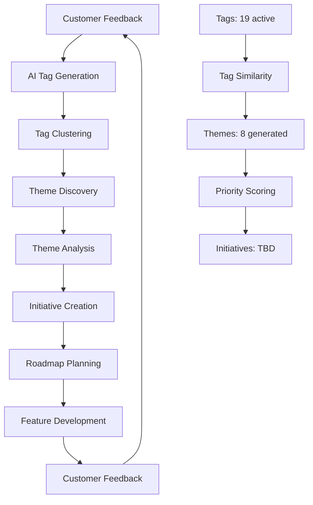

# 🎯 Tags → Themes → Initiatives: Product Roadmap Architecture Handoff

**Version:** 1.0  
**Date:** January 2025  
**Status:** 🚀 **READY FOR ROADMAP IMPLEMENTATION**

---

## 📋 Executive Summary

This document outlines the complete data hierarchy and architecture for building a customer-driven product roadmap where **Tags** (customer feedback patterns) automatically roll up to **Themes** (AI-discovered insights) which then roll up to **Initiatives** (product roadmap items). This creates a closed loop from customer voice to shipped features.

---

## 🏗️ Data Hierarchy Architecture

### **Level 1: Tags** (Customer Feedback Patterns)
**Status:** ✅ **FULLY OPERATIONAL**

**What They Are:**
- AI-generated tags from individual customer feedback items
- Semantic patterns extracted from survey responses and feedback
- Granular insights about specific features, pain points, and experiences

**Current Implementation:**
- **19 active tags** in the system
- Examples: `accuracy`, `automation`, `integration`, `interface`, `notifications`, `positive feedback`
- Each tag has usage count, sentiment scores, and trend analysis
- Automatically generated via OpenAI GPT-4 analysis

**Database Schema:**
```sql
tags (
  id: uuid,
  name: text,           -- "accuracy"
  normalized_name: text, -- "accuracy" 
  category: text,       -- "feature", "sentiment", "pain_point"
  usage_count: integer, -- How many times used
  avg_sentiment: float, -- Average sentiment score
  trend: text,          -- "up", "down", "stable"
  company_id: uuid
)
```

**Key Properties:**
- **Granularity:** Individual feedback items
- **Volume:** High (hundreds per month)
- **Source:** Direct customer feedback
- **Actionability:** Low (too granular for roadmap)

---

### **Level 2: Themes** (AI-Discovered Insights)
**Status:** ✅ **FULLY OPERATIONAL**

**What They Are:**
- AI-generated themes that group related tags and feedback
- Higher-level insights about customer needs and product opportunities
- Semantic clustering of feedback patterns into actionable insights

**Current Implementation:**
- **8 live themes** generated from customer feedback
- Examples: "Enhanced Market Analysis and Project Intelligence Success", "Enhanced Bidding Automation Success"
- Each theme includes priority scores, customer impact, and evidence
- Generated via GPT-4 analysis of tag clusters

**Database Schema:**
```sql
themes (
  id: uuid,
  name: text,                    -- "Enhanced Market Analysis Success"
  description: text,             -- AI-generated description
  priority_score: float,         -- 0-100 priority score
  customer_count: integer,       -- Number of customers affected
  mention_count: integer,        -- Total mentions
  avg_sentiment: float,          -- Average sentiment
  trend: text,                   -- "increasing", "decreasing", "stable"
  status: text,                  -- "active", "in_progress", "archived"
  supporting_tags: text[],       -- Related tag names
  related_tag_ids: uuid[],       -- Database references
  company_id: uuid,
  created_at: timestamp,
  updated_at: timestamp
)
```

**Key Properties:**
- **Granularity:** Grouped feedback patterns
- **Volume:** Medium (8-20 per month)
- **Source:** AI analysis of tags
- **Actionability:** High (roadmap-ready insights)

---

### **Level 3: Initiatives** (Product Roadmap Items)
**Status:** 🔄 **TO BE IMPLEMENTED**

**What They Should Be:**
- Product roadmap items derived from themes
- Specific features, improvements, or strategic initiatives
- Business-driven prioritization with theme input
- Timeline and resource allocation

**Proposed Database Schema:**
```sql
initiatives (
  id: uuid,
  title: text,                   -- "Mobile Field Measurement App"
  description: text,             -- Detailed initiative description
  initiative_type: text,         -- "feature", "improvement", "strategic"
  priority: text,                -- "high", "medium", "low"
  status: text,                  -- "planned", "in_progress", "completed", "cancelled"
  start_date: date,
  target_date: date,
  actual_completion_date: date,
  effort_estimate: text,         -- "small", "medium", "large", "epic"
  business_value: text,          -- "high", "medium", "low"
  customer_impact: text,         -- "high", "medium", "low"
  supporting_theme_ids: uuid[],  -- Which themes support this initiative
  supporting_tag_ids: uuid[],    -- Direct tag references
  company_id: uuid,
  created_by: uuid,              -- User who created
  assigned_to: uuid[],           -- Team members assigned
  created_at: timestamp,
  updated_at: timestamp
)
```

**Key Properties:**
- **Granularity:** Strategic product items
- **Volume:** Low (5-15 per quarter)
- **Source:** Business + theme analysis
- **Actionability:** Highest (executable roadmap)

---

## 🔄 Data Flow Architecture

### **Bottom-Up Flow: Feedback → Tags → Themes → Initiatives**



### **Real-World Example Flow:**

1. **Customer Feedback:** "PlanSwift is intuitive and fast for digital takeoffs. Material calculations are very accurate."

2. **Tags Generated:** `positive feedback`, `accuracy`, `automation`, `planswift`

3. **Theme Created:** "Enhanced Accuracy and Automation Success"
   - **Priority Score:** 85%
   - **Customer Count:** 1
   - **Sentiment:** +0.90
   - **Supporting Tags:** accuracy, automation, positive feedback

4. **Initiative Opportunity:** "Improve PlanSwift Calculation Accuracy"
   - **Type:** Feature Enhancement
   - **Priority:** High
   - **Business Value:** High
   - **Customer Impact:** High
   - **Effort:** Medium

---

## 🎯 Roadmap Implementation Strategy

### **Phase 1: Initiative Creation Interface**
**Timeline:** 2-3 weeks

**Features:**
- **Theme-to-Initiative Mapping:** Convert themes into roadmap items
- **Priority Scoring:** Combine theme priority with business value
- **Resource Planning:** Effort estimation and team assignment
- **Timeline Management:** Start dates, target dates, dependencies

**UI Components:**
- Initiative creation modal with theme selection
- Priority matrix (Customer Impact vs Business Value)
- Timeline view with Gantt-style planning
- Initiative status tracking

### **Phase 2: Automated Theme Analysis**
**Timeline:** 1-2 weeks

**Features:**
- **Theme Trend Analysis:** Week-over-week changes
- **Customer Impact Scoring:** Weighted by customer count and sentiment
- **Business Value Mapping:** Connect themes to business metrics
- **Initiative Suggestions:** AI-powered initiative recommendations

### **Phase 3: Roadmap Dashboard**
**Timeline:** 2-3 weeks

**Features:**
- **Initiative Overview:** Status, progress, and timeline
- **Theme Impact Tracking:** How initiatives address customer themes
- **Customer Feedback Loop:** Connect shipped features back to themes
- **ROI Tracking:** Measure impact of initiatives on customer satisfaction

---

## 📊 Current Data Foundation

### **Tags System (Operational)**
- ✅ **19 active tags** with usage analytics
- ✅ **AI generation** from customer feedback
- ✅ **Sentiment analysis** and trend tracking
- ✅ **Duplicate detection** and normalization
- ✅ **Company-scoped** data isolation

### **Themes System (Operational)**
- ✅ **8 AI-generated themes** from real data
- ✅ **Priority scoring** based on customer impact
- ✅ **Evidence linking** to supporting feedback
- ✅ **Status management** (Active, In Progress, Archived)
- ✅ **CRUD operations** with edit modal
- ✅ **Real-time updates** and API integration

### **Initiatives System (To Build)**
- 🔄 **Database schema** designed
- 🔄 **UI components** to be implemented
- 🔄 **Theme integration** to be built
- 🔄 **Priority matrix** to be created
- 🔄 **Timeline management** to be added

---

## 🛠️ Technical Implementation Notes

### **API Endpoints Needed**
```typescript
// Initiative Management
GET    /api/admin/initiatives           // List initiatives
POST   /api/admin/initiatives           // Create initiative
GET    /api/admin/initiatives/[id]      // Get initiative details
PATCH  /api/admin/initiatives/[id]      // Update initiative
DELETE /api/admin/initiatives/[id]      // Delete initiative

// Theme-Initiative Mapping
POST   /api/admin/initiatives/[id]/themes    // Link themes to initiative
DELETE /api/admin/initiatives/[id]/themes    // Unlink themes
GET    /api/admin/themes/[id]/initiatives    // Get initiatives for theme
```

### **Database Relationships**
```sql
-- Many-to-many relationship between themes and initiatives
initiative_themes (
  initiative_id: uuid,
  theme_id: uuid,
  created_at: timestamp
)

-- Many-to-many relationship between tags and initiatives (direct)
initiative_tags (
  initiative_id: uuid,
  tag_id: uuid,
  created_at: timestamp
)
```

### **UI Component Architecture**
```
/roadmap
├── page.tsx                    // Main roadmap dashboard
├── initiatives/
│   ├── page.tsx               // Initiative list
│   ├── [id]/
│   │   └── page.tsx          // Initiative details
│   └── create/
│       └── page.tsx          // Create initiative
├── components/
│   ├── InitiativeCard.tsx    // Initiative display card
│   ├── InitiativeModal.tsx   // Create/edit modal
│   ├── PriorityMatrix.tsx    // Priority visualization
│   ├── TimelineView.tsx      // Gantt-style timeline
│   └── ThemeSelector.tsx     // Theme selection component
```

---

## 📈 Success Metrics

### **Customer Impact Metrics**
- **Theme Coverage:** % of customer feedback themes addressed by initiatives
- **Sentiment Improvement:** Change in customer sentiment after initiative delivery
- **Customer Satisfaction:** NPS/CSAT improvements from theme-driven features

### **Business Impact Metrics**
- **Initiative Completion Rate:** % of initiatives delivered on time
- **Theme-to-Initiative Conversion:** % of themes that become initiatives
- **ROI Tracking:** Business value delivered per initiative

### **Product Team Metrics**
- **Roadmap Alignment:** % of initiatives derived from customer themes
- **Feedback Loop Speed:** Time from customer feedback to initiative creation
- **Delivery Velocity:** Features shipped per quarter from theme-driven roadmap

---

## 🚀 Next Steps for Roadmap Implementation

### **Immediate (Week 1)**
1. **Create Initiative Database Schema**
   - Implement `initiatives` table
   - Add relationship tables for themes and tags
   - Create database migrations

2. **Build Initiative API Endpoints**
   - CRUD operations for initiatives
   - Theme and tag linking endpoints
   - Authentication and authorization

### **Short-term (Weeks 2-3)**
1. **Implement Initiative UI Components**
   - Initiative creation and editing modals
   - Theme selection and mapping interface
   - Priority matrix visualization

2. **Create Roadmap Dashboard**
   - Initiative overview and status tracking
   - Theme impact visualization
   - Timeline and progress tracking

### **Medium-term (Weeks 4-6)**
1. **Advanced Analytics**
   - Theme trend analysis and forecasting
   - Customer impact scoring automation
   - Initiative ROI tracking

2. **Integration Features**
   - Export to project management tools
   - Slack/Teams notifications for updates
   - Customer feedback loop completion

---

## 💡 Key Insights for Roadmap Design

### **Customer-Driven Prioritization**
- **Themes provide the "what"** - customer needs and pain points
- **Initiatives provide the "how"** - business solutions and features
- **Priority comes from customer impact + business value**

### **Data-Driven Decision Making**
- **Every initiative should be traceable** to customer themes
- **Success metrics should measure** both customer and business impact
- **Feedback loop completion** validates roadmap effectiveness

### **Scalable Architecture**
- **Tags scale with feedback volume** (hundreds per month)
- **Themes scale with insight discovery** (dozens per month)
- **Initiatives scale with roadmap capacity** (dozens per quarter)

---

## 📚 Related Documentation

- **THEMES_IMPLEMENTATION_HANDOFF.md** - Technical implementation details
- **ONGOING_PRD.md** - Current platform status and roadmap
- **COMMON_PROBLEMS.md** - Troubleshooting and known issues
- **TAG_SYSTEM_ENHANCEMENTS_CHECKLIST.md** - Tag system improvements

---

**🎯 This handoff document provides the complete foundation for building a customer-driven product roadmap that closes the loop from customer voice to shipped features.**
